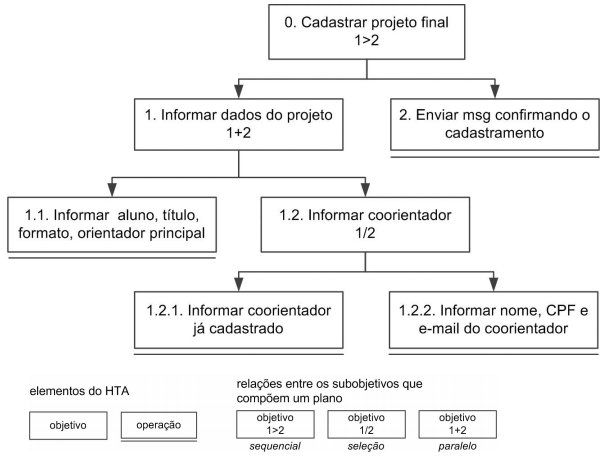
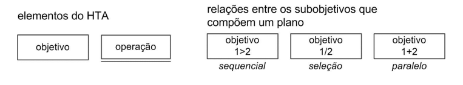
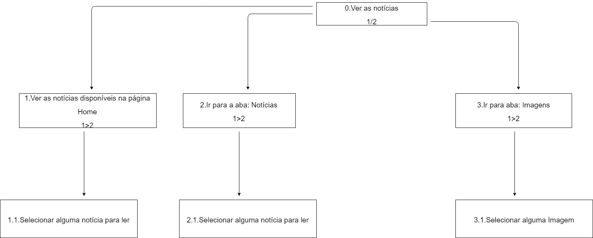
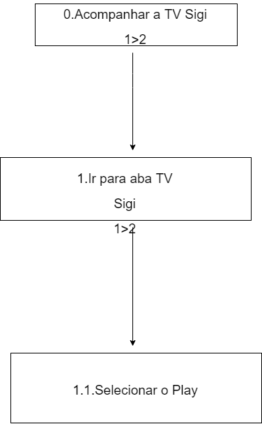
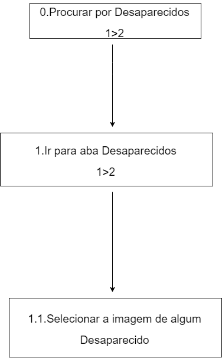
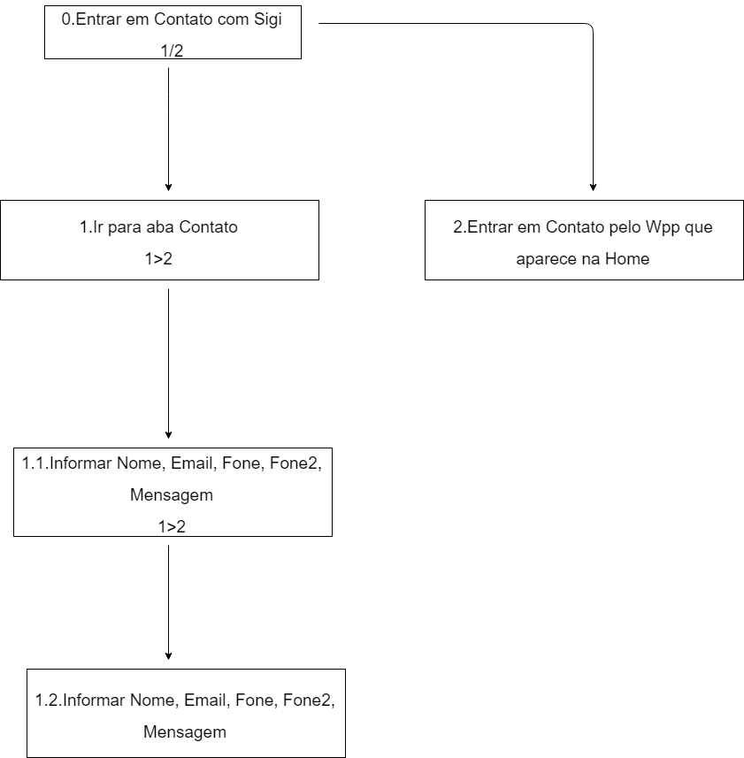

# Análise de Tarefa

## Introdução

Uma análise de tarefas é utilizada para se ter um entendimento sobre qual é o trabalho dos usuários, como eles o realizam e por quê realizam. Geralmente é realizado em um nível mais alto de abstração, visto que muitos detalhes a respeito do sistema ainda não estarão bem definidos.

Alguns métodos de análise de tarefas mais comuns:

- Análise Hierárquica de tarefas (HTA - Hierarchical Task Analysis)
- GOMS (Goals, Operators, Methods, Selection Rules)
- ConcurTaskTrees (CTT)

Apenas a Análise Hierárquica de Tarefas será estudada mais aprofundamente, porque foi o método escolhido e utilizado para realizar a análise de tarefa da plataforma SigiVilares.

## Análise Hierárquica de Tarefas (HTA)

A Análise Hierárquica de Tarefas tem como proposta entender as competências e habilidades associadas às tarefas complexas e, usualmente, não repetitivas, bem como auxiliar na identificação de problemas de desempenho. A ideia básica desta análise é relacionar o que as pessoas fazem (tarefas), por que o fazem e quais são as consequências, caso não façam corretamente.

O ponto de partida desta análise são os objetivos do usuário. A partir de um objetivo, as principais tarefas associadas ao alcance deste objetivo são identificadas.

- Tarefa: É qualquer parte do trabalho que precisa ser realizado

- Objetivo: Representam o que o usuário quer realizar utilizando o sistema

- Operação: É um objetivo que não possui nenhum subobjetivo (tarefa não mais decomposta)

- Plano: São os subobjetivos de um objetivo

- 1>2: Sequêncial

- 1/2: Seleção

- 1+2: Paralelo

### HTA1: Ver Notícias

### HTA2: Acompanhar TV Sigi

### HTA3: Procurar Desaparecidos

### HTA4: Entrar em contado com Sigi Vilares

## Referências

BARBOSA. **Interação Humano-Computador, Capítulo 8 - Princípios e Diretrizes para o Design de IHC**. 2º/2019. 12 páginas. Material apresentado para a disciplina de Interação Humano Computador no curso de Engenharia de Software da UnB, FGA.

SIGI VILARES. **Blog do SigiVilares**, 2010-2014. Disponível em: <https://www.sigivilares.com.br>. Acesso em: 09 setembro 2019.
